<picture>
  <source media="(prefers-color-scheme: dark)" srcset="./assets/banner-dark.svg">
  <source media="(prefers-color-scheme: light)" srcset="./assets/banner-light.svg">
  
</picture>

  
  
  
  
  

I build systems that test and evaluate other systems. At PostFinance I work in load and performance engineering and look after the AI/ML initiatives in our team, like the chatbot and voicebot, automated test evaluation and ML tooling around quality and performance. I finished my BSc in AI & ML at HSLU in 2026 and went straight on to the MSc, still next to the job.

What I enjoy most is working with LLMs and building models from the ground up, with a focus on MLOps and AIOps. After hours it is mostly web and app development, and now and then a game.

## What I work on

| | |
|---|---|
| **PostFinance** | Load and performance testing since 2023. Load scenarios in JMeter and Groovy, test tooling on both the development and the usage side, and evaluation infrastructure for our AI systems |
| **HSLU** | MSc in Applied Data Science and Artificial Intelligence, work-study. BSc in Artificial Intelligence & Machine Learning with a Medtech & Healthcare specialisation, completed 2026 |
| **Le Nerima Foundation** | IT and logistics, including the website at [lenerima.ch](https://www.lenerima.ch) |

## Selected projects

| Project | What it is | Built with |
|---|---|---|
| **Chatbot evaluation pipeline** BSc thesis, private | Evaluation setup for a customer-support chatbot: a generator, a mock RAG chatbot and an LLM judge | Python, vLLM, MLflow, Kubernetes |
| [**Pneumonia detection**](https://github.com/NevinJulian/HSLU.MEDIMG.Project) Medical imaging module | Chest X-ray classification with a fine-tuned ResNet-18 and a DenseNet with attention. Includes ablations, a threshold analysis and a bias check. Both models reach an AUROC of about 0.99 on the test set | PyTorch |
| [**World Cup Predictor**](https://github.com/NevinJulian/WorldCupPredictor) | Predicts international football matches and simulates the 2026 World Cup. Trained on every international match since 1872, with an Elo baseline as the bar to beat | Python |
| **Jass Counter** private, in progress | Schieber Jass scorekeeper for Android with groups, games, points and a shared Kasse | React Native, Expo, Supabase |
| [**lenerima.ch**](https://www.lenerima.ch) | Website for the Le Nerima Foundation with transparent hand-drawn animations | Next.js, Payload CMS |
| [**Raytracer**](https://github.com/NevinJulian/HSLU.Raytracing) | Raytracing built from the ground up | C# |

## Tools I use

<table>
  <tr>
    <td><b>Languages</b></td>
    <td></td>
  </tr>
  <tr>
    <td><b>ML and data</b></td>
    <td> plus vLLM, LiteLLM, MLflow, Prefect and pandas</td>
  </tr>
  <tr>
    <td><b>Web and apps</b></td>
    <td></td>
  </tr>
  <tr>
    <td><b>Infra and ops</b></td>
    <td> plus JMeter for load testing</td>
  </tr>
</table>

  
Used in earlier projects

   
  

## GitHub activity

  <picture>
    <source media="(prefers-color-scheme: dark)" srcset="./profile/stats-dark.svg">
    
  </picture>
  <picture>
    <source media="(prefers-color-scheme: dark)" srcset="./profile/top-langs-dark.svg">
    
  </picture>

<picture>
  <source media="(prefers-color-scheme: dark)" srcset="./profile/snake-dark.svg">
  
</picture>

Most of my work lives in private repositories and on internal GitLab, so the public numbers only show part of it.

## Background

| When | What |
|---|---|
| since 2026 | MSc in Applied Data Science and Artificial Intelligence, HSLU |
| 2026 | BSc in Artificial Intelligence & Machine Learning, HSLU |
| since 2023 | Performance Test Engineer, PostFinance, Bern |
| 2021 to 2023 | Project staff, Kantonsspital Obwalden |
| 2017 to 2021 | Apprenticeship as Informatiker EFZ in application development, Pilatus Aircraft, Stans, with Berufsmaturität |
